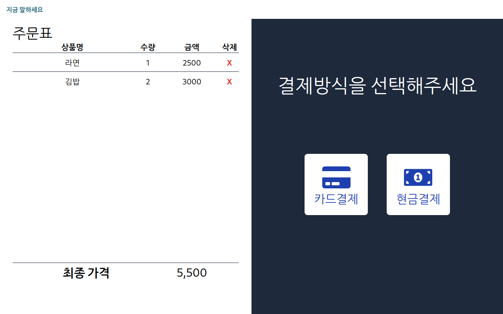
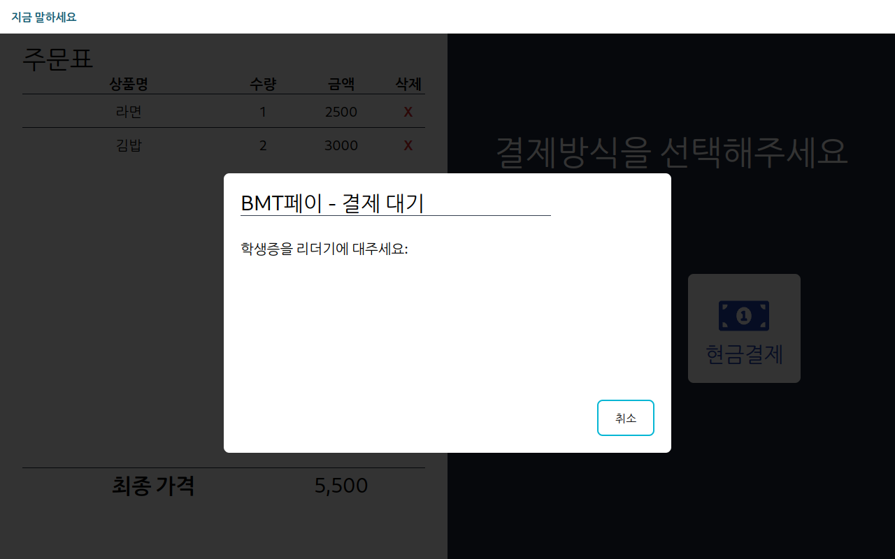
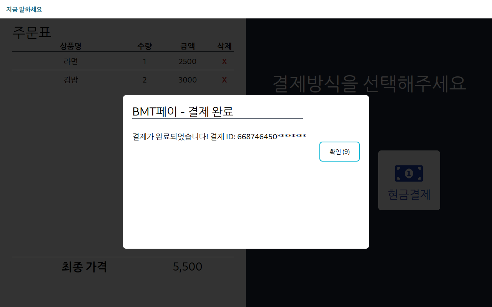

# AI Voice Recognition Kiosk

Graduation work of Busan Mechanical Technical High School project class

## Overview

Voice Recognition Kiosk is a kiosk system that allows users to **add or delete food items to their order** using only their voice and implements a payment system utilizing NFC.
It supports users to order and pay for food conveniently by using a screen implemented with React.js and Python and ChatGPT based **speech recognition and generative AI answer generation technology**.

## Features

* Add and delete food orders via voice recognition
* Display voice recognition results and generative AI answers
* Payment system utilizing NFC

## Technology stack

* Frontend: React.js
* Backend: Python, ChatGPT
* Hardware: Raspberry Pi 5, Sunfounder 10.1” touchscreen
* Other: PN532 NFC reader (I2C)

## Install and run

1. Clone the project. `git clone --recursive https://github.com/ne0ekspert/voice-activated-kiosk.git`
2. Install the required libraries. pip install -r requirements.txt`
3. Run the server with the command `python main.py`.
4. navigate to the address `http://localhost:80` in your web browser.

## How to use

1. Use voice commands to add or delete food to an order.
2. Check the voice recognition results and generative AI answers.
3. Touch your NFC card to the reader to pay. (We have mimicked the payment step using a student ID with ISO 14443 NFC)

## Screenshot

Expand

Idle screen

---]

Order Screen

--- Order Screen

Order Selected Screen

--- Payment

Payment Selection Screen

--- Payment Selection Screen

Card Payment Screen

--- Card Payment Success Screen

Card Payment Success Screen

--- Cash Payment Screen

Cash Payment Screen

## Hardware

TBD

## Demo Video

TBD

Translated with DeepL.com (free version)
