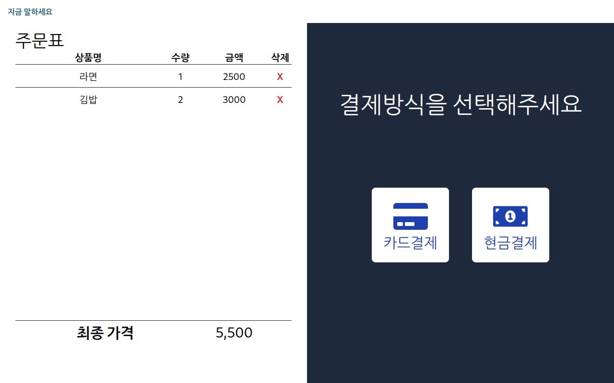
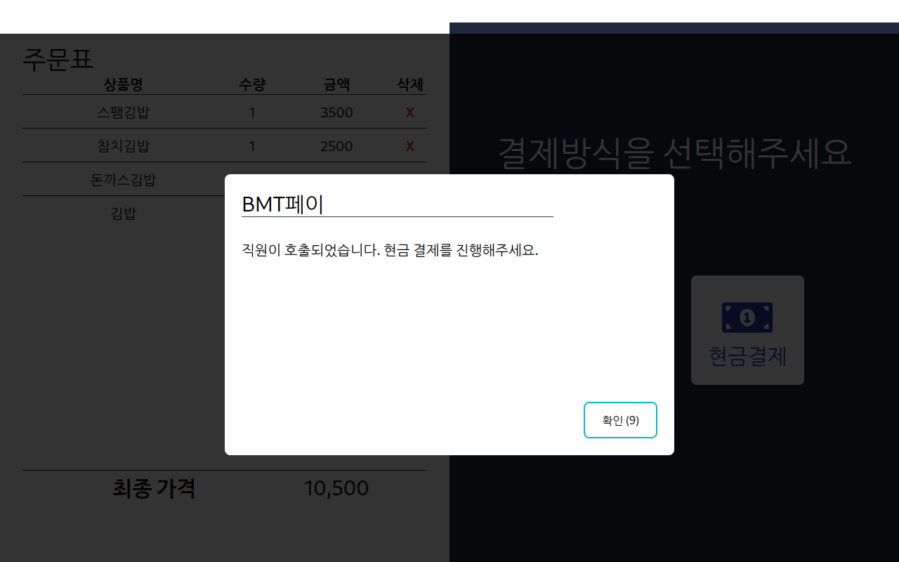

# AI 음성 인식 키오스크

부산기계공업고등학교 프로젝트 수업 졸업 작품

Read this in [English](./README.en.md)

## 개요

음성 인식 키오스크는 음성만으로 **음식을 주문에 추가하거나 삭제**하고 NFC를 활용하여 결제 시스템을 구현하는 키오스크 시스템입니다.
**음성 인식 및 생성형 AI 대답 생성 기술을 활용**하여 사용자가 편리하게 음식을 주문하고 결제할 수 있도록 지원합니다.

## 기능

* 음성 인식을 통한 음식 주문 추가 및 삭제
* 음성 인식 결과 및 생성형 AI 대답 표시
* NFC를 활용한 결제 시스템

## 기술 스택

* 프론트엔드, 백엔드: Next.js, OpenAI API
* 하드웨어: Raspberry Pi 5, Sunfounder 10.1" 터치스크린
* 기타: PN532 NFC 리더 (I2C)

## 설치 및 실행

1. 프로젝트를 복제합니다. `git clone --recursive https://github.com/ne0ekspert/voice-activated-kiosk.git`
2. 필요한 라이브러리를 설치합니다. `npm install`
3. `npm run build` 명령어로 서버를 빌드합니다.
4. `npm start` 명령어로 서버를 시작합니다.
5. 웹 브라우저에서 `http://localhost:3000` 주소로 이동합니다.

## 사용 방법

1. 음성 명령을 사용하여 음식을 주문에 추가하거나 삭제합니다.
2. 음성 인식 결과 및 생성형 AI 대답을 확인합니다.
3. NFC 카드를 리더에 터치하여 결제합니다. (ISO 14443 NFC로 학생증을 사용하여 결제 단계를 모방했습니다)

## 스크린샷

펼치기

대기 화면

---

주문 화면

---

주문 선택한 화면

---

결제 선택 화면

---

카드 결제 화면

---

카드 결제 성공 화면

---

현금 결제 화면

## 구매 목록

| 품명 | 규격 | 수량 | 단가 | 배송비 | 금액 |
|:----:|:----:|:-----|:-----|:-------|:-----|
| 도어 자석 캐치 빠찌링 래치 댐퍼 가구 푸쉬 스텐 찬 + L자 | | 4 | 2,900 | 3,000 | 14,600 |
| **라즈베리파이 10.1인치 터치스크린 LCD 모니터** | 9.8 x 7.24 x 3(T) in | 1 | 210,000 | 0 | 210,100 |
| **라즈베리파이 5 8GB +5A 어댑터 +64GB microSD** | 85 x 56 x 16 mm | 1 | 139,810 | 0 | 139,810 |
| **라즈베리파이 카메라모듈 3 와이드** | 25 x 24 x 11.5 mm | 1개 | 53,900 | 0 | 53,900 |
| **13.56MHz PN532 NFC 모듈 [SMP0044]** | | 1 | 22,000 | 2,700 | 24,700 |
| **아답터, 전원 코드 일체형** | 220V / 12V 1.5A [내경 2.1~2.5mm/외경 5.5mm] | 1 | 5,500 | 2,700 | 8,200 |
| ~~3.5 스테레오 to 3.5 스테레오 M/F2 변환케이블~~ | 0.2m | 1 | 1,430 | 2,700 | 4,130 |
| **테스트[CH254] 소켓 점퍼 케이블 40P** | 20mm F/F, M/F, M/M | 3 | 935 | 2,700 | 5,505 |
| **ETM-009 지향성 마이크** | | 1 | 65,000 | 3,000 | 68,000 |
| **Micro HDMI to HDMI 변환 케이블 [SZH-CAB16]** | 1.5m | 1 | 2,200 | 0 | 2,200 |
| ~~[OEM] 스텐 접시머리 십자볼트 탭핑스크류 (1종)~~ | M6 20mm | 20 | 165 | 0 | 3,300 |
| ~~MDF 접착제 목공 본드 목재 하드보드 공사 205~~ | 800g | 2 | 7,800 | 3,000 | 18,600 |
| MDF | 50 x 300 x 18T | 15 | 1,000 | 5,000 | 20,000 |
| MDF | 290 x 200 x 9T | 5 | 1,000 | 0 | 5,000 |
| (1+1)무료택배 3D입체/숙면/수면안대 | | 3 | 3,900 | 0 | 11,700 |
| 시각장애인 지팡이 맹인 스틱 시각장애인용 4단접이식 | | 1 | 14,900 | 3,000 | 17,900 |
| **라즈베리파이5, 제로 카메라 어댑터 케이블 (22pin to 15pin)** | 30cm | 1 | 1,650 | 0 | 1,650 |
| **유그린 U-30724 USB2.0 to Audio 컨버터(블랙)** | | 1 | 11,000 | 0 | 11,000 |
| **카나레 연장케이블 L-2E5 리안 3.5 TRS(암)-3.5 TRS** | 1.5m | 1 | 17,000 | 3,500 | 20,500 |
| 영일락카총판 황색 페인트락카 스프레이 | | 3 | 2,100 | 3,000 | 9,300 |
| **Britz 브리츠 BA-R9 SoundBar 사운드바 스피커** | | 1 | 21,900 | 0 | 21,900 |
| 일신 락카 스프레이 페인트 도색 인테리어 셀프 무광 프라이머 사비 흑색 은색 | 흑무광 | 2 | 1,880 | 3,000 | 6,760 |
| 합계 ||||| 678,755 |

* 구동하는데 필요한 재료 목록은 굵게, 구동하는데 필요하지 않지만 프로젝트에 사용된 재료 목록은 보통, 사용되지 않은 재료 목록은 취소선 처리했습니다.

## 시연 영상

[유튜브에서 시청하기](https://www.youtube.com/watch?v=Tz12pwekxME)
